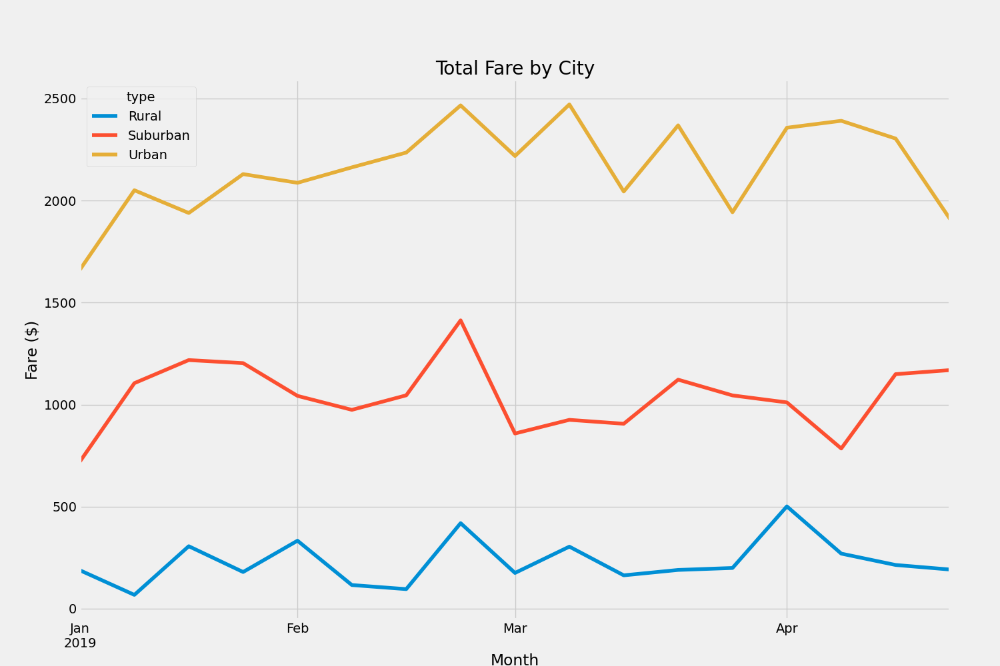

# Module_5_Challenge
**Overview**
The purpose of this practice was to get total PyBer fares by the type of city it is(Rural, Suburban, Urban). Using pandas, I created series based on certain groups and combined those in to a new data frame. Once all the data needed was gathered, I created a plot to visualize the data

**Results**

Unsurprisingly, it seems that those in urban areas spend more on PyBer than those in rural areas. PyBer is more needed in these areas and used more often.
Next is Suburbs in the middle, still a pretty high rate but nothing even close to Urban.
Rural seemed to have the most use in April and end of February, but seems to be rarely used.

**Summary**
Based on the data, it seems the PyBer service is being used quite often throughout the first quarter of the year. Urban areas use it often, suburban less and rural rarely.
I would recommend focusing most of our advertising in the urban areas at the beginning of the year to gain awareness, and then through the peak areas of the first quarter(end of Feb, early March) hopefully the PyBer name is known enough that people know to go to it when in need.
